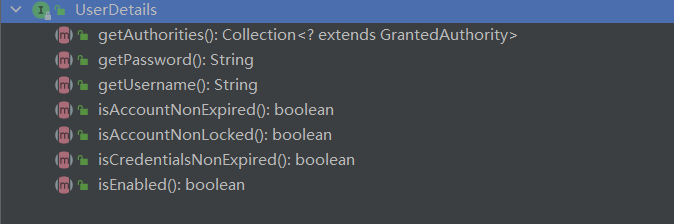
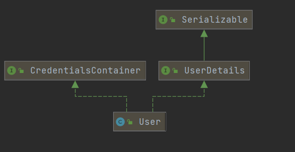
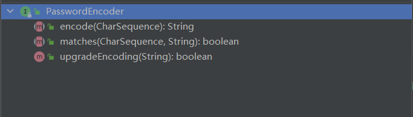

# Spring Security


## UserDetailsService

自定义登录逻辑

```java
public interface UserDetailsService {

	/**
	 * Locates the user based on the username. In the actual implementation, the search
	 * may possibly be case sensitive, or case insensitive depending on how the
	 * implementation instance is configured. In this case, the <code>UserDetails</code>
	 * object that comes back may have a username that is of a different case than what
	 * was actually requested..
	 * @param username the username identifying the user whose data is required.
	 * @return a fully populated user record (never <code>null</code>)
	 * @throws UsernameNotFoundException if the user could not be found or the user has no
	 * GrantedAuthority
	 */
	UserDetails loadUserByUsername(String username) throws UsernameNotFoundException;

}
```

返回值 `UserDetails` 接口



`User` 实现 `UserDetails` 接口




## PasswordEncoder

Spring Security要求容器必须有 `PasswordEncoder` 实例，所以当自定义登录逻辑时要求必须给容器注入 `PasswordEncoder` 的 bean 对象


### 接口介绍




 

- encode :  加密password
- matches： 验证password是否匹配，第一个参数是需要被加密的密码，第二个是存储的密码
- upgradeEncoding：二次加密


### 接口实现

`BCryptPasswordEncoder`


## WebSecurityConfigurerAdapter


## UsernamePasswordAuthenticationFilter


## 自定义登录逻辑

## 角色权限判断

## 自定义403处理方案

```

```

